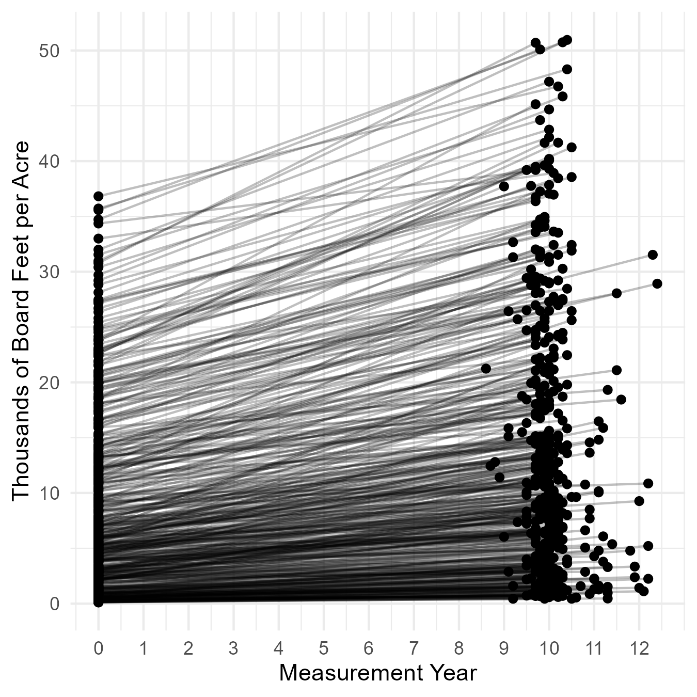
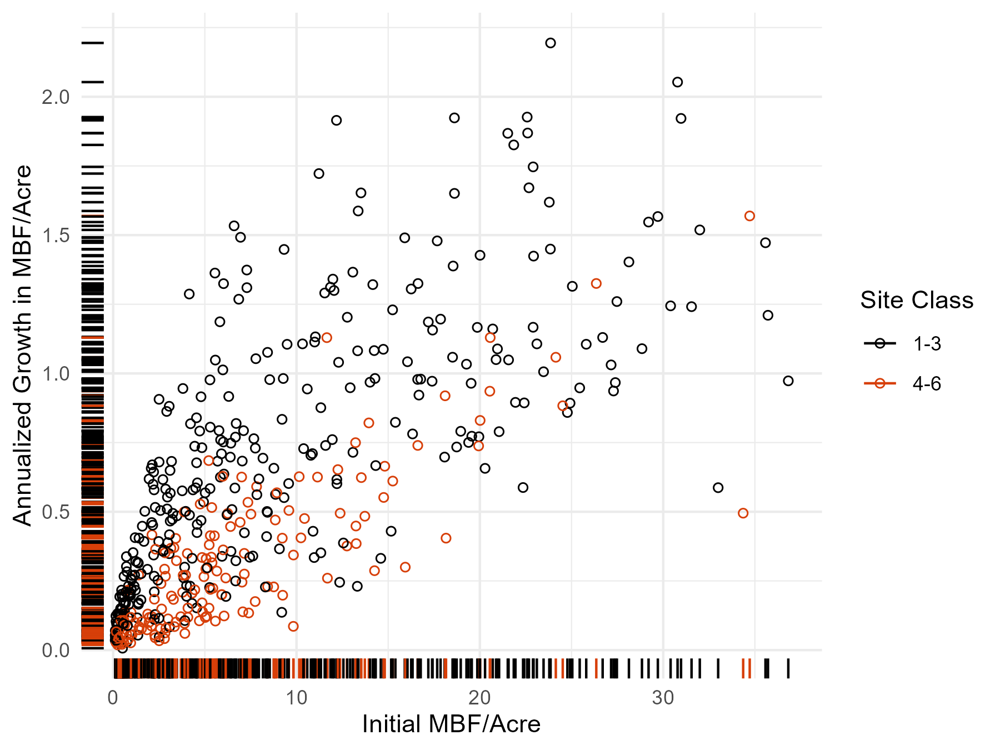
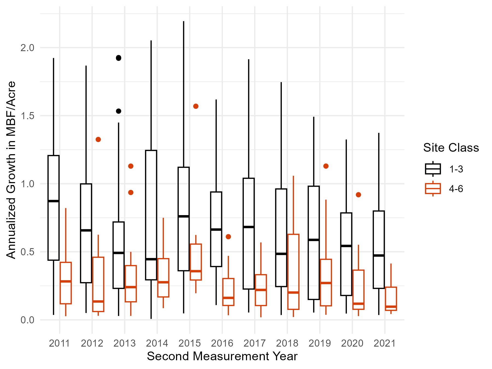
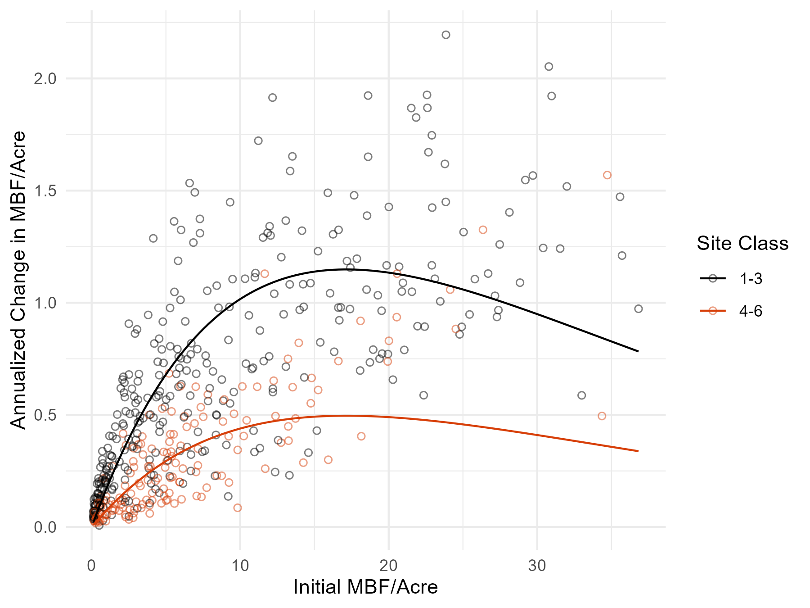

Andrew Steinkruger  
AEC 699  
April 6, 2026  

# 1. Introduction and Data

Let's check out Forest Inventory Analysis data on tree growth in Oregon.

In this exercise, I use four basic geoms: 

1. geom_point 
2. geom_line 
3. geom_rug 
4. geom_function 

I did learn something new about ggplot2: geom_function is only a nice shortcut for univariate functions. With a multivariate function, the syntax for geom_function becomes unwieldy. In that case, computing a large set of function values explicitly (rather than implicitly with geom_function) becomes easier than figuring out the syntax, and then geom_line or geom_smooth would do just as well. 

Anyway, let's load some packages.

```{r packages, warning = FALSE, message = FALSE}

library(tidyverse) # General
library(gt) # Tables
library(stargazer) # Regression Tables
library(magrittr) # Pipes

color_beav = "#D73F09" # In the absence of a beav theme. 

```

Now, data. We can process some large tables into our estimates of interest.

```{r data_preparation, eval = FALSE}

dat_condition =
  "data/OR_COND.csv" %>%
  read_csv %>%
  select(INVYR,
         PLT_CN,
         CONDID,
         OWNGRPCD,
         FORTYPCD,
         SITECLCD)

dat_tree =
  "data/OR_TREE.csv" %>%
  read_csv %>%
  select(INVYR,
         PLT_CN,
         TRE_CN = CN,
         CONDID,
         SPGRPCD)

dat_growth =
  "data/OR_TREE_GRM_ESTN.csv" %>%
  read_csv %>%
  select(INVYR,
         PLT_CN,
         TRE_CN,
         LAND_BASIS,
         ESTIMATE,
         COMPONENT,
         SUBPTYP_GRM,
         REMPER,
         TPAGROW_UNADJ,
         ANN_NET_GROWTH,
         EST_BEGIN,
         EST_END) %>%
  filter(LAND_BASIS == "TIMBERLAND") %>% # Subset to timberland
  filter(SUBPTYP_GRM == 1) %>% # Subset to subplots
  filter(ESTIMATE == "VOLBFNET") %>% # Subset to net board feet
  filter(COMPONENT == "SURVIVOR") %>% # Subset to surviving trees
  select(-ESTIMATE, -COMPONENT, -LAND_BASIS) %>%
  left_join(dat_tree) %>%
  filter(SPGRPCD == 10) %>% # Subset to Douglas fir species
  left_join(dat_condition) %>%
  filter(OWNGRPCD == 40) %>% # Subset to private owners
  filter(FORTYPCD %in% 200:203) %>% # Subset to Douglas fir conditions
  # Board feet/acre
  mutate(EST_BEGIN_ACRE = EST_BEGIN * TPAGROW_UNADJ,
         EST_END_ACRE = EST_END * TPAGROW_UNADJ,
         ANN_NET_GROWTH_ACRE = ANN_NET_GROWTH * TPAGROW_UNADJ) %>% 
  # Board feet/acre by plot
  group_by(INVYR, PLT_CN, REMPER, SITECLCD) %>%
  summarize(EST_BEGIN_ACRE_PLOT = sum(EST_BEGIN_ACRE),
            EST_END_ACRE_PLOT = sum(EST_END_ACRE),
            ANN_NET_GROWTH_ACRE_PLOT = sum(ANN_NET_GROWTH_ACRE)) %>%
  ungroup %>% 
  # Drop outliers
  filter(ntile(ANN_NET_GROWTH_ACRE_PLOT, 100) %in% 2:99) %>% 
  filter(ntile(EST_BEGIN_ACRE_PLOT, 100) %in% 2:99) %>% 
  filter(ntile(EST_END_ACRE_PLOT, 100) %in% 2:99) %>% 
  # Site classes into bins and BF to MBF. 
  mutate(SITECLCD_Bin = ifelse(SITECLCD < 4, 0, 1),
         MBF_0 = EST_BEGIN_ACRE_PLOT / 1000,
         MBF_1 = EST_END_ACRE_PLOT / 1000,
         MBF_Annual = ANN_NET_GROWTH_ACRE_PLOT / 1000) %>% 
  select(-ends_with("_PLOT")) %T>% 
  # Export
  write_csv("data/dat_assignment1.csv")

```

We can read and tabulate the processed data.

```{r data, warning = FALSE, message = FALSE}

dat = "data/dat_assignment1.csv" %>% read_csv

dat %>% head %>% gt

```

Next, we can visualize the data.

# 2. Visualization and Modeling

## 2.1. Yield

What do the data really show? Yields over intervals.

```{r vis_1}

vis_1 = 
  dat %>% 
  mutate(INVYR_0 = INVYR - REMPER) %>% 
  rename(INVYR_1 = INVYR) %>% 
  mutate(INVYR_1 = INVYR_1 - INVYR_0,
         INVYR_0 = INVYR_0 - INVYR_0) %>% 
  pivot_longer(cols = c(INVYR_0, INVYR_1, MBF_0, MBF_1),
               names_to = c("VARIABLE", "YEAR"),
               names_sep = "_") %>% 
  pivot_wider(names_from = VARIABLE, values_from = value) %>% 
  ggplot() + 
  geom_point(aes(x = INVYR,
                 y = MBF)) +
  geom_line(aes(x = INVYR,
                y = MBF,
                group = PLT_CN),
            alpha = 0.25) +
  scale_x_continuous(breaks = 0:12) +
  labs(x = "Measurement Year",
       y = "Thousands of Board Feet per Acre") +
  theme_minimal()

ggsave("out/vis_1_assignment1.png",
       vis_1,
       dpi = 300,
       width = 4.5,
       height = 4.5)

```

{fig-alt="A plot of yield over measurement years." fig-align="center" width="66%"}

**Figure 1.** Thousands of board feet per acre for each plot by measurement year.

## 2.2. Growth

But what do we really care about? Growth, or the change in yield with time.

```{r vis_2}

vis_2 = 
  dat %>% 
  ggplot(aes(x = MBF_0,
                 y = MBF_Annual,
                 color = SITECLCD_Bin %>% factor(labels = c("1-3", "4-6")))) + 
  geom_point(shape = 21,
             fill = NA) +
  geom_rug() +
  scale_color_manual(values = c("black", color_beav)) +
  labs(x = "Initial MBF/Acre",
       y = "Annualized Growth in MBF/Acre",
       color = "Site Class") +
  theme_minimal() 

ggsave("out/vis_2_assignment1.png",
       vis_2,
       dpi = 300,
       width = 6,
       height = 4.5)

```

{fig-alt="A plot of annualized yield growth over initial yield." fig-align="center" width="80%"}

**Figure 2.** Annualized growth in yield with respect to initial yield.

## 2.3. Time Series

What if the calendar year matters?

```{r vis_3}

vis_3 = 
  dat %>% 
  ggplot() + 
  geom_boxplot(aes(x = INVYR %>% factor,
                   y = MBF_Annual,
                   color = SITECLCD_Bin %>% factor(labels = c("1-3", "4-6"))),
               fill = NA) +
  scale_color_manual(values = c("black", color_beav)) +
  labs(x = "Second Measurement Year",
       y = "Annualized Growth in MBF/Acre",
       color = "Site Class") +
  theme_minimal()

ggsave("out/vis_3_assignment1.png",
       vis_3,
       dpi = 300,
       width = 6,
       height = 4.5)

```

{fig-alt="A plot of annualized yield growth by calendar year." fig-align="center" width="80%"}

**Figure 3.** Annualized growth in yield by site class with respect to calendar years.

It doesn't really look like the calendar year matters with the information at hand.

## 2.4. Growth Modeling

To wrap up, let's fit a simple growth model to the data.

We can first derive a convenient form for the [Ricker model](https://doi.org/10.1139/f54-039).

Let $N_t$ denote yield at time $t$, $r$ a growth rate, and $K$ a limiting parameter (not a carrying capacity).

Let $dN_t = N_{t + 1} - N_t$.

$$
\begin{align}
N_{t + 1} & = N_t e ^ {r(1 - \frac{N_t}{k})} \\
ln(N_{t + 1}) & = ln(N_t e ^ {r(1 - \frac{N_t}{K})}) \\
ln(N_{t + 1}) - ln(N_t) & = r - \frac{r}{K}N_t \\
ln(\frac{dN_t}{N_t}) & = r - \frac{r}{K}N_t
\end{align}
$$

We can estimate this expression by ordinary least squares.

Let $Y = ln(\frac{dN_t}{N_t})$, $\beta_0 = r$, $\beta_1 = \frac{r}{K}$, and $X_1 = N_t$.

Then we are estimating $Y = \beta_0 + \beta_1 X_1 + \epsilon$.

With binned site class $X_2 \in \{0, 1\}$ we can instead estimate $Y = \beta_0 + \beta_1 X_1 + \beta_2 X_2 + \epsilon$.

```{r mod, output = 'asis'}

mod = 
  dat %>% 
  mutate(Y = log(MBF_Annual / MBF_0),
         X_1 = MBF_0,
         X_2 = SITECLCD_Bin, 
         .keep = "none") %>% 
  lm(Y ~ X_1 + X_2,
     data = .)

b_0 = mod$coefficients[[1]]
b_1 = mod$coefficients[[2]]
b_2 = mod$coefficients[[3]]

stargazer(mod, type = "html")

```

The convenient Ricker transformation unfortunately returns inconvenient coefficient values.

That aside, things look good! This is a fair model for a first pass.

Let's visualize the model results and call it a day.

```{r vis_4}

vis_4 = 
  dat %>% 
  ggplot() + 
  geom_point(aes(x = MBF_0,
                 y = MBF_Annual,
                 color = SITECLCD_Bin %>% factor(labels = c("1-3", "4-6"))),
             shape = 21,
             alpha = 0.50, 
             fill = NA) +
  geom_function(aes(x = MBF_0,
                    color = "1-3"),
                fun = ~ .x * exp(b_0 + b_1 * .x)) +
  geom_function(aes(x = MBF_0,
                    color = "4-6"),
                fun = ~ .x * exp(b_0 + b_1 * .x + b_2)) +
  scale_color_manual(values = c("black", color_beav)) +
  labs(x = "Initial MBF/Acre",
       y = "Annualized Change in MBF/Acre",
       color = "Site Class") +
  theme_minimal()

ggsave("out/vis_4_assignment1.png",
       vis_4,
       dpi = 300,
       width = 6,
       height = 4.5)

```

{fig-alt="A plot of annualized yield growth by initial yield with model estimates." fig-align="center" width="80%"}

**Figure 4.** Annualized growth in yield by site class with model estimates.

The fit is great for lower initial yields, and not so great for higher ones. 

A next step is to compare these model results to some values in the literature. 

# 3. Conclusion

We learned a little about Douglas fir growth. 
